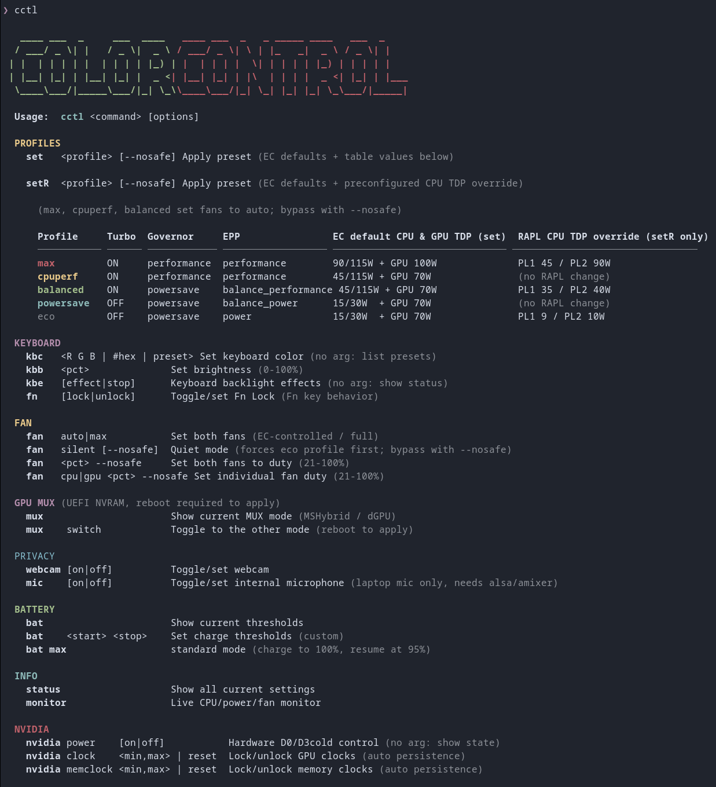
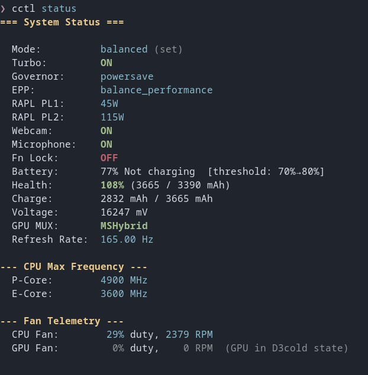
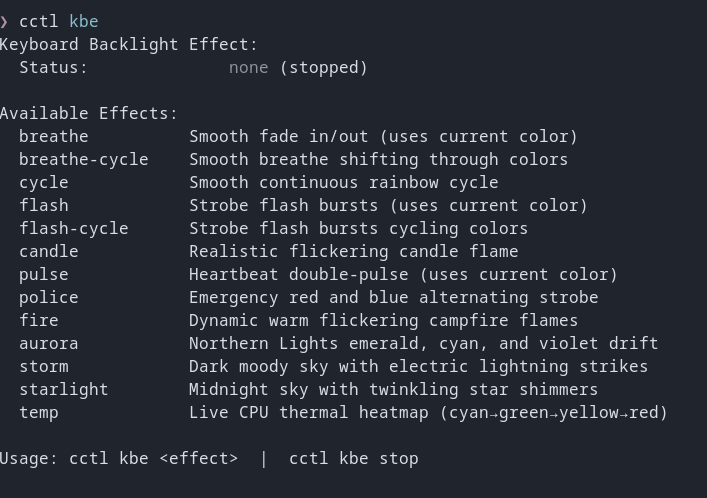
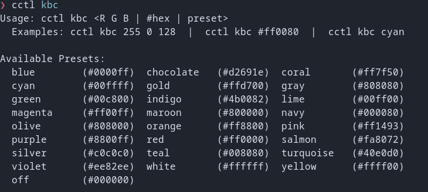

# CCTL — ColorControl

Linux CLI alternative to the Windows-only Colorful Laptop Control Center. Fast, single-binary tool for Colorful Evol P15 laptops (Clevo/TUXEDO chassis) — controls power profiles, fans, keyboard backlight, display, battery, GPU MUX switching, and NVIDIA GPU. Pure C, no GUI, no daemon.

## Hardware Compatibility

Specifically designed for the **Colorful Evol P15** series (Clevo/TUXEDO chassis).

### Tested Hardware
| Laptop | CPU | GPU | Keyboard |
|---|---|---|---|
| Colorful Evol P15 | Intel Core i7-13620H | RTX 4060 Mobile 100W | Single-zone RGB |
| Colorful Evol P15 | Intel Core i5-12500H | RTX 4050 Mobile 100W | Single-zone RGB |

### Supported Configurations
* **Series:** Colorful Evol P15 series
* **GPUs:** NVIDIA GeForce RTX 40 Series Mobile
* **CPUs:** Intel CPUs
* **Keyboard:** Single-zone RGB keyboard (tested)

> **Note:** Built specifically for Colorful Evol P15 series laptops. Other laptop models or other Clevo/TUXEDO variants may have different EC register layouts, fan byte orders, or GPU profile slots — use at your own risk.

---

## Quick Start

1. Download the pre-built `cctl` binary from the **[Releases page](https://github.com/bhusann/cctl/releases)**.

```bash
# 2. Make it executable and install cctl system-wide (installs to /usr/local/bin, sets up passwordless sudo & auto-elevation)
chmod +x ./cctl && sudo ./cctl install

# 3. Install kernel drivers via DKMS (required for fans, keyboard backlight, battery)
cctl drivers-manage

# 4. Ready to use immediately (privileged commands auto-elevate seamlessly, no manual sudo or aliases needed):
cctl set balanced          # apply a power profile (auto-elevates via sudo)
cctl fan auto              # set fans to automatic (auto-elevates via sudo)
cctl status                # view all current settings
```

---

## Screenshots

**`cctl` — full command reference**



**`cctl status` — all current settings at a glance**



**`cctl kbe` — keyboard backlight effects**



**`cctl kbc` — keyboard color presets**



---

## Power Profiles

`set <profile> [--nosafe]` applies preset (EC defaults + table values below).

`setR <profile> [--nosafe]` applies preset (EC defaults + preconfigured CPU TDP override).

```
Profile     Turbo  Governor     EPP                EC default CPU & GPU TDP (set)  RAPL CPU TDP override (setR only)
─────────── ────── ──────────── ────────────────── ────────────────────────────── ────────────────────────────────
max         ON     performance  performance        90/115W + GPU 100W              PL1 45 / PL2 90W
cpuperf     ON     performance  performance        45/115W + GPU 70W               (no RAPL change)
balanced    ON     powersave    balance_performance 45/115W + GPU 70W              PL1 35 / PL2 40W
powersave   OFF    powersave    balance_power      15/30W  + GPU 70W               (no RAPL change)
eco         OFF    powersave    power              15/30W  + GPU 70W               PL1 9 / PL2 10W
```

> **Fan Safety Defaults & Safety Disclaimer**: `--nosafe` is a flag that bypasses cctl's fan safety and keeps your current fan state instead of letting cctl change it. The safety exists because if fans were previously locked to `silent`, the EC suppresses fan speeds even under high heat — so to prevent overheating and thermal throttling, `cctl` automatically resets fans to **`AUTO`** when activating high-power profiles (`max`, `cpuperf`, `balanced`) or enabling `turbo on`. Pass `--nosafe` (e.g. `cctl set max --nosafe` or `cctl turbo on --nosafe`) to bypass that reset. Setting manual fan duty (`cctl fan <pct> --nosafe` or `cctl fan cpu|gpu <pct> --nosafe`) strictly requires `--nosafe`.
>
> ⚠️ **Safety Notice & Disclaimer**: Safety defaults (running without `--nosafe`) are strongly recommended for daily use to protect your hardware. The `--nosafe` flag is intended strictly for experimenting or one-time use for a specific purpose — **not for daily or regular use**. Overriding safety mechanisms can lead to severe overheating, thermal throttling, or hardware stress; the author is not responsible for any damage or instability caused by using this flag.
>
> **`set max` vs `setR max`**: Plain `set max` leaves RAPL untouched, running at OEM platform limits (PL1 90W / PL2 115W CPU, 100W GPU). `setR max` caps sustained CPU draw to 45W (burst to 90W) to leave thermal headroom for the GPU.


---

## Commands

### Keyboard Backlight
```bash
cctl kbc <color>                # Set keyboard color: R G B (0-255), #RRGGBB, or preset name
cctl kbb <pct>                  # Brightness (0-100%)
cctl kbe [effect|stop]          # Start an effect, stop & restore original color/brightness, or show status & list effects
cctl fn [lock|unlock]          # Toggle or set Fn Lock (no arg toggles, or lock/unlock)
```

Color presets: `blue` `chocolate` `coral` `cyan` `gold` `gray` `green` `indigo` `lime` `magenta` `maroon` `navy` `olive` `orange` `pink` `purple` `red` `salmon` `silver` `teal` `turquoise` `violet` `white` `yellow` `off`

Effect presets (single zone): `breathe` `breathe-cycle` `cycle` `flash` `flash-cycle` `candle` `pulse` `pulse-cycle` `police` `fire` `aurora` `storm` `starlight` `temp`

*Manual Status Check*: Run `cctl kbe` to view the current active effect.

### Fan Control
```bash
cctl fan auto|max               # Both fans: EC automatic / 100% full speed
cctl fan silent [--nosafe]      # Quiet mode (forces eco profile first; bypass with --nosafe)
cctl fan <pct> --nosafe         # Set both fans to duty cycle (21-100%, requires --nosafe)
cctl fan cpu|gpu <pct> --nosafe # Set individual fan duty (requires --nosafe)
```

### GPU MUX Switching
Switches between **MSHybrid** (iGPU + dGPU) and **dGPU** (NVIDIA GPU only). A reboot is required to apply the change.

```bash
cctl mux                        # Show current MUX mode (MSHybrid / dGPU) & pending status
cctl mux switch                 # Toggle MUX mode (stages in UEFI NVRAM, reboot to apply)
```

> **X11 quirk:** After switching to **dGPU** mode the display may come up at **40 Hz instead of 165** — run `cctl rr 165` to set it back. *(X11 sessions only.)*

### Privacy
```bash
cctl webcam [on|off]            # Toggle or set webcam
cctl mic [on|off]               # Toggle or set internal microphone (laptop mic only, needs alsa/amixer)
```

### Battery
```bash
cctl bat                        # Show current thresholds and battery health
cctl bat <start> <stop>         # Set charge thresholds (custom, e.g. 40 80)
cctl bat max                    # Standard: charge to 100%, resume at 95%
```

### Info
```bash
cctl status                     # Print all current settings (profiles, GPU MUX, telemetry)
cctl monitor                    # Live CPU/power/fan/memory monitor (color-coded)
cctl update                     # Update cctl + refresh the offline driver cache
cctl --version                  # Print version and exit (also -V)
```

### NVIDIA GPU
```bash
cctl nvidia power [on|off]              # Hardware D0/D3cold control; no arg shows state
cctl nvidia clock <min,max> | reset     # Lock/unlock GPU clocks (auto persistence)
cctl nvidia memclock <min,max> | reset  # Lock/unlock memory clocks (auto persistence)
```

### Display
> **Note:** Display commands need a native **X11** session — if your desktop doesn't support one (e.g. Wayland), the `DISPLAY` section is hidden from `cctl --help` and the refresh rate from `cctl status`.
>
> Only the display panel's preconfigured refresh rates are supported — run `cctl rr` to list the valid ones for your screen and pick from that list.

```bash
cctl rr                         # List all supported refresh rates
cctl rr [1|2|<rate>]            # Set refresh rate (1=highest, 2=lowest, or explicit value like 60 or 144)
cctl scale <factor|WxH|off>    # GPU scaling (0.75, 1920x1080, or off to reset)
```

### Profile Individual Overrides
```bash
cctl turbo on|off [--nosafe]    # Toggle Intel turbo boost (on sets fans to auto; bypass with --nosafe)
cctl gov powersave|performance  # CPU scaling governor
cctl epp <preference>           # performance, balance_performance, balance_power, power
cctl rapl <pl1> <pl2>           # Set PL1/PL2 in watts (use 'skip' to omit one)
```
>
> **RAPL limits:** PL2 ≤ 115 W always. PL1 ≤ 45 W — up to **90 W while max mode is active**.

---

## Build

```bash
make                # Standard build (profiles, fans, display, battery, nvidia clock/power)
```

---

## Kernel Drivers

The Clevo/TUXEDO driver stack (`clevo_acpi`, `tuxedo_keyboard`, `tuxedo_io`) is required for fan control, keyboard backlight, battery thresholds, and EC GPU profile slots. The installer handles DKMS registration, build, and modprobe config.

**Driver sources live only in the mirror repo:** https://github.com/bhusann/tuxedo-drivers-cctl-mirror — a readable `drivers/` folder plus the pre-packed `drivers.tar.gz`. Every GitHub **release** of cctl also attaches that *identical* tarball.

Install or uninstall directly with the script (it lives in the mirror repo):

```bash
git clone https://github.com/bhusann/tuxedo-drivers-cctl-mirror
sudo tuxedo-drivers-cctl-mirror/drivers/driverinstall.sh --install
sudo tuxedo-drivers-cctl-mirror/drivers/driverinstall.sh --uninstall
tuxedo-drivers-cctl-mirror/drivers/driverinstall.sh --status   # no root needed
```

### Supported Distros

Auto-installs `dkms` + kernel headers if missing, with confirmation prompt:

| Package Manager | Distros | Tested |
|---|---|---|
| `pacman` | Arch, Manjaro, EndeavourOS, CachyOS, Garuda | ✅ Arch, CachyOS |
| `apt` | Debian, Ubuntu, Mint, Pop!_OS, Zorin | — |
| `dnf` | Fedora (standard Workstation/Spins), RHEL, Rocky, Alma | — |
| `zypper` | openSUSE Tumbleweed/Leap | — |
| `xbps` | Void Linux | — |
| `emerge` | Gentoo | — |
| `eopkg` | Solus | — |

> **Immutable / Atomic OS note:** Atomic and immutable editions of Fedora (Silverblue, Kinoite, Atomic Desktops, Bazzite, etc. using `rpm-ostree`) are **not supported** because the root filesystem is read-only and DKMS modules cannot persist across image updates. Only standard, non-atomic Fedora (Workstation, KDE Spin, etc. using regular `dnf`) is supported. On unrecognized distros, the installer points to the driver source in the mirror repo for manual installation.

---

## Uninstallation

Drivers first, then the cctl binary — in that order, so cctl is still around for the clean driver removal.

### Automated Uninstallation (Recommended)

1. **Kernel drivers** — `sudo cctl drivers-manage` and select the uninstall option (it cleanly unloads the modules and deregisters DKMS):

```bash
sudo cctl drivers-manage   # select the uninstall option
```

2. **cctl binary & sudoers** — `cctl install` places the binary in `/usr/local/bin/cctl` and configures a passwordless sudo rule in `/etc/sudoers.d/cctl` for auto-elevation (validated with `visudo -c` on install; the previous rule is backed up as `/etc/sudoers.d/cctl.bak`). To remove them:

```bash
# Remove installed binary
sudo rm -f /usr/local/bin/cctl

# Remove passwordless sudo rule (+ backup)
sudo rm -f /etc/sudoers.d/cctl /etc/sudoers.d/cctl.bak

# Optional: remove the persistent driver cache. Kept by default on purpose —
# it is what makes `cctl drivers-manage` able to reinstall/uninstall the
# drivers later with no internet, no tarball beside the binary, no prompt.
sudo rm -rf /var/lib/cctl
```

### Manual Uninstallation

Same order — unload and remove the drivers first, then the cctl binary itself.

Run the mirror's script directly (works without cctl):

```bash
git clone https://github.com/bhusann/tuxedo-drivers-cctl-mirror
sudo tuxedo-drivers-cctl-mirror/drivers/driverinstall.sh --uninstall
```

Or do it step by step:

1. **Unload active kernel modules** (in reverse dependency order):
   ```bash
   sudo modprobe -r clevo_acpi
   sudo modprobe -r tuxedo_io
   sudo modprobe -r tuxedo_keyboard
   ```

2. **Unregister and remove DKMS module**:
   ```bash
   sudo dkms remove tuxedo-drivers/1.0 --all
   sudo rm -rf /var/lib/dkms/tuxedo-drivers
   ```

3. **Remove driver source files and modprobe options**:
   ```bash
   sudo rm -rf /usr/src/tuxedo-drivers-1.0
   sudo rm -f /etc/modprobe.d/tuxedo_keyboard.conf
   ```

4. **Update module dependency cache**:
   ```bash
   sudo depmod -a
   ```

5. **cctl binary & sudoers**:
   ```bash
   # Remove installed binary
   sudo rm -f /usr/local/bin/cctl

   # Remove passwordless sudo rule (+ backup)
   sudo rm -f /etc/sudoers.d/cctl /etc/sudoers.d/cctl.bak

   # Optional: remove the persistent driver cache
   sudo rm -rf /var/lib/cctl
   ```

---

## Developer Notes

- **RAPL 0.4 GHz Throttle** — Only package-0 (`intel-rapl:0`) is safe to write. Touching sub-zones (`intel-rapl:0:X`) or platform `psys` triggers an EC conflict that hard-throttles the CPU to 400 MHz.
- **RAPL 90 W mode tracking** — The up-to-90 W PL1 ceiling applies while max mode is active: recorded by the last `cctl set max` / `cctl setR max`; shown as `Mode:` in `cctl status`, and `EC default` when no profile has been applied yet.

- **EC Fan Byte Order** — Clevo's EC expects reversed byte order depending on command context. Auto-restore uses `{0xFF, fan_idx}`, duty cycle uses `{fan_idx, duty}`.

- **GPU Fan Duty Register** — ACPI `FANINFO1` byte 2 is stuck at ~15% on this model. `cctl` reads GPU fan duty from `FANINFO2` (`0x64`, byte 0) for accurate readings.

- **Keyboard Backlight Type Override (`force_backlight_type=6`)** — Why the driver installer forces type 6:
  - In `drivers/src/clevo_leds.h:clevo_leds_init()` (path within the mirror repo):
    1. The driver calls `clevo_evaluate_method2(0x0D, 0)` to read the ACPI `_DSM` buffer. `buffer[0x0f]` holds the keyboard type ID. Known IDs include: `0x00` (NONE), `0x01` (FIXED), `0x02` (3ZONE), `0x06` (1ZONE), `0xF3` (PERKEY).
    2. The Colorful Evol P15 EC returns `0x26`. Because this ID is unknown to the driver, probe switches fail to match, registering no `led_classdev` — resulting in no `/sys/class/leds/*::kbd_backlight` and leaving brightness/color ioctls non-functional.
    3. `0x26` (`0b00100110`) vs `0x06` (`0b00000110`): the low nibble is identical, while the high bits likely signify a newer revision or flag. The wire protocol (`0x67` + `0xF4000000 | brightness`, zone color) remains standard single-zone RGB.
    4. Passing module option `force_backlight_type=6` (`tuxedo_keyboard`) bypasses ACPI buffer evaluation directly:
       ```c
       if (force_backlight_type >= 0) type = force; else { /* SPECS retry x3 -> 0x52/0x7A fallback */ }
       ```
    5. Upstream driver fix would be handling `case 0x26: type = 1ZONE;` or matching `(type & 0x0F) == 0x06`. Until upstreamed, forcing type 6 via modprobe is required.
  - **Customizing your keyboard type:**
    If you have a different variant and need to force another keyboard backlight mode, edit `/etc/modprobe.d/tuxedo_keyboard.conf`:
    ```
    options tuxedo_keyboard force_backlight_type=<value>
    ```
    Known values:
    * `1` — FIXED white backlight (`0x01`)
    * `2` — 3-zone RGB (`0x02`)
    * `6` — 1-zone RGB (`0x06`) *(default configured by this project)*
    * `243` — Per-key RGB (`0xF3`)

  - **Sysfs LED Exposure (`/sys/class/leds`):**
    All keyboard backlight controls registered by the driver are exposed under `/sys/class/leds`:
    * For **1-zone RGB (`force_backlight_type=6`)**: A single device entry is created:
      ```
      /sys/class/leds/rgb:kbd_backlight/
      ```
      (Contains controls like `brightness`, `multi_intensity`, `color`, etc.)
    * For **3-zone RGB (`force_backlight_type=2`)**: The kernel driver registers 3 separate LED device entries under `/sys/class/leds` corresponding to each keyboard zone (e.g., `rgb:kbd_backlight`, `rgb:kbd_backlight_1`, `rgb:kbd_backlight_2` or separate zone descriptors), allowing each zone's color and brightness to be tuned individually via sysfs.
    * For **Fixed White (`force_backlight_type=1`)**: A `white:kbd_backlight` directory is exposed for brightness level control.

    > **Note:** `cctl`'s command implementation currently only supports **1-zone RGB** (using type 6). If your hardware uses 3-zone RGB or per-key RGB, you can manage the zones directly through their respective `/sys/class/leds` folders or adapt `cctl`'s source code (`cctl.c`) to control individual zones.

- **GPU Display MUX via UEFI NVRAM (Insyde H2O)** — The laptop features a physical display multiplexer with two BIOS modes:
  - `MSHybrid` (panel driven by Intel iGPU; NVIDIA dGPU provides render offload).
  - `dGPU` (panel wired directly to NVIDIA GeForce RTX card; Intel iGPU is unmapped from PCI display class).
  - The hardware MUX state cannot be flipped on-the-fly inside an active OS session (ACPI `_DSM` methods on this Insyde board hang the display subsystem). Instead, switching is staged via the UEFI NVRAM variable `Setup-a04a27f4-df00-4d42-b552-39511302113d` at file offset 430 (`0x03` = MSHybrid, `0x02` = dGPU). The new mode is latched during POST upon reboot.
  - **How it works:** `cctl mux switch` writes to the UEFI Setup NVRAM variable (`Setup-a04a27f4-df00-4d42-b552-39511302113d` offset 430). The setting is committed to SPI flash and latched by firmware during POST on the next boot. It includes safety guards: blob length verification (1204 B) and unknown value refusal.
- **dGPU mode boots at 40 Hz (X11)** — Happens on warm *and* cold boots, so it is not EC state. The panel's EDID is identical in both MUX modes: the base block's first (preferred) DTD is 2560x1440 @ **40 Hz**, while the 165 Hz timing lives in the DisplayID extension. The nvidia X driver takes the base-block preferred timing as the initial mode (boots 40); modesetting over i915 in MSHybrid prefers the DisplayID timing (boots 165). Not a capability problem — xrandr lists both rates in dGPU mode. Fix: `cctl rr 165` (user-facing note in the GPU MUX section).
- **Keyboard effect state (`kbe`)** — Run `cctl kbe` to view the active effect, PID, and preserved base state (it re-elevates automatically — the `/run/cctl_kbe.state` file is root-only; `sudo cat` it directly if you prefer).
- **Release tarball provenance** — The `drivers.tar.gz` attached to releases is fetched straight from the mirror — never rebuilt — and the release workflow refuses to publish if its sha256 drifts from the constant baked into `cctl.c`.
- **drivers-manage source order** — how `cctl drivers-manage` finds `drivers.tar.gz` (first match wins):
  1. persistent cache **`/var/lib/cctl/drivers.tar.gz`** — sha-verified; enables fully offline reinstall; stale/corrupt entries are reported, ignored, and replaced on the next verified acquisition
  2. `drivers.tar.gz` beside the cctl binary — sha-checked on the spot; a stale copy is warned about and skipped
  3. download from the mirror into a private temp dir — on failure it names the folder for a manual copy
  4. full path to a `drivers.tar.gz` you already have — checked in place first; staged only if valid
- **drivers-manage verification & update atomicity** — Every candidate is verified against the sha256 **baked into the cctl binary before extraction** — spoofed or stale files are refused. Whatever passes is also copied to `/var/lib/cctl/` *before* extraction, so the next reinstall or uninstall needs neither internet nor the original file. `cctl update` itself is all-or-nothing: it stages and verifies **both** release assets (binary + tarball) in tmp first and places them only when both pass — if the tarball fetch or hash check fails, **nothing** is installed.

---

## License

`cctl` own code is licensed under the MIT License — see [LICENSE](LICENSE).

The driver code (in the [mirror repo](https://github.com/bhusann/tuxedo-drivers-cctl-mirror)'s `drivers/` folder) is **not** MIT. It is derived from the TUXEDO Linux driver project and remains under **GPL-2.0-or-later** — see [drivers/LICENSE](https://github.com/bhusann/tuxedo-drivers-cctl-mirror/blob/main/drivers/LICENSE) and [THIRD-PARTY-NOTICES](THIRD-PARTY-NOTICES).

## Credits

`cctl` uses driver code from the TUXEDO Linux driver project:

https://github.com/tuxedocomputers/tuxedo-drivers

The driver code is licensed under GPL-2.0-or-later. Copyright belongs to the respective original authors (TUXEDO Computers GmbH and contributors).

GPU MUX switch findings were informed by arbitrary-string's clevo-control-panel:

https://github.com/arbitrary-string/clevo-control-panel
