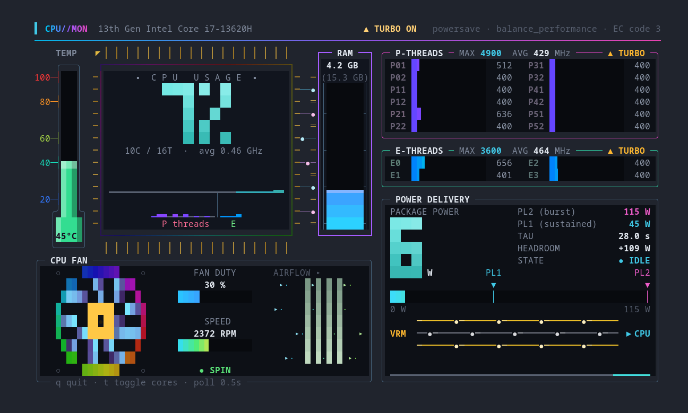
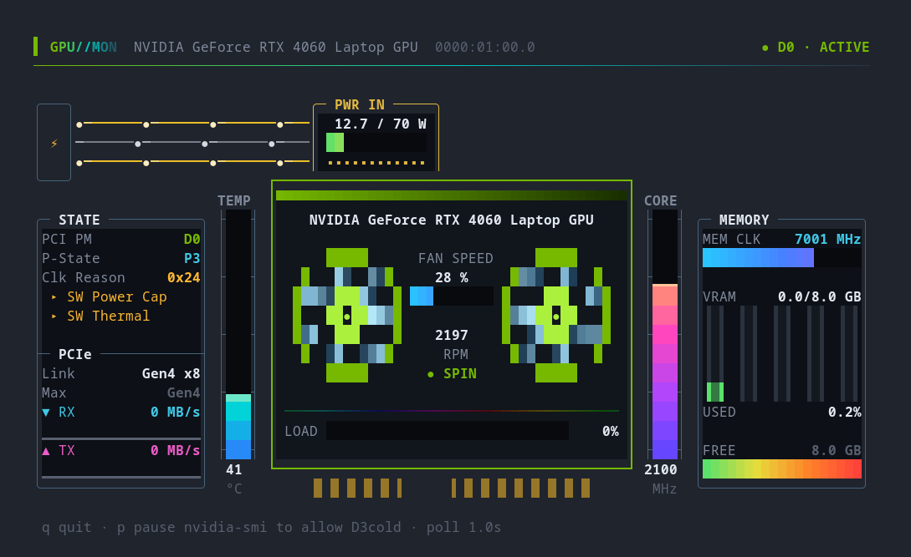

# CCTL — Linux Control Center for Colorful Laptops

Looking for a Linux control center alternative for a Colorful laptop? CCTL
(ColorControl) is a lightweight CLI built for Colorful Evol P15 laptops using
Clevo/TUXEDO chassis. Manage EC power profiles, CPU and GPU fans, keyboard RGB
colors and effects, battery charge modes and thresholds, display refresh rate
and scaling, GPU MUX switching, NVIDIA clocks, webcam, and microphone. It also
includes live CPU and GPU monitors and manages its DKMS drivers. CCTL is written
in C and runs without a GUI or persistent daemon; keyboard effects use a small
background process only while active.

## Hardware Compatibility

Specifically designed for the **Colorful Evol P15** series (Clevo/TUXEDO chassis).

### Tested Hardware
| Laptop | CPU | GPU | Keyboard |
|---|---|---|---|
| Colorful Evol P15 | Intel Core i7-13620H | RTX 4060 Mobile 100W | Single-zone RGB |
| Colorful Evol P15 | Intel Core i5-12500H | RTX 4050 Mobile 100W | Single-zone RGB |

### Supported Configurations
* **Series:** Colorful Evol P15 series
* **GPUs:** NVIDIA GeForce RTX 40 Series Mobile
* **CPUs:** Intel CPUs
* **Keyboard:** Single-zone RGB keyboard (tested)

> **Note:** Built specifically for Colorful Evol P15 series laptops. Other laptop models or other Clevo/TUXEDO variants may have different EC register layouts, fan byte orders, or EC profile codes — use at your own risk.

---

## Quick Start

1. Download the pre-built `cctl` binary from the **[Releases page](https://github.com/bhusann/cctl/releases)**.

```bash
# 2. Make it executable and install cctl system-wide (installs to /usr/local/bin, sets up passwordless sudo & auto-elevation)
chmod +x ./cctl && sudo ./cctl install

# 3. Install kernel drivers via DKMS (required for fans, keyboard backlight, battery)
cctl drivers-manage

# 4. Ready to use immediately (privileged commands auto-elevate seamlessly, no manual sudo or aliases needed):
cctl set balanced          # apply a power profile (auto-elevates via sudo)
cctl fan auto              # set fans to automatic (auto-elevates via sudo)
cctl status                # view all current settings
```

## Updating cctl

1. Download the latest `cctl` binary from the [official Releases page](https://github.com/bhusann/cctl/releases).
2. In the folder where you downloaded it, run:

   ```bash
   chmod +x ./cctl
   sudo ./cctl install
   ```

3. When asked to upgrade or reinstall cctl, type `y` to confirm. The installer updates the installed binary and sudo rule.

---

## Screenshots

**`cctl` — full command reference**


**`cctl status` — all current settings at a glance**


**`cctl cpumon` — live CPU, memory, fan, and power readings**



**`cctl gpumon` — live NVIDIA GPU readings**



**`cctl kbe` — keyboard backlight effects**


**`cctl kbc` — keyboard color presets**


---

## Power Profiles

`set <profile> [--nosafe]` applies preset (EC defaults + table values below).
Built-in profiles are quick-use presets, not official or universal
recommendations. Choose what suits your workload, or save a preferred
combination as a [custom profile](#custom-profiles).

```
Profile     EC profile code Turbo  Governor     EPP                EC default CPU & GPU TDP
─────────── ─────────────── ────── ──────────── ────────────────── ──────────────────────────────
max         2               ON     performance  performance        90/115W + GPU 100W
cpuperf     3               ON     powersave    performance        45/115W + GPU 70W
balanced    3               ON     powersave    balance_performance 45/115W + GPU 70W
powersave   1               OFF    powersave    balance_power      15/30W  + GPU 70W
silent/eco  0               OFF    powersave    power              15/30W  + GPU 70W
```

> [!CAUTION]
> Silent fan mode and manual fan duty may keep fans quiet or fixed regardless of
> CPU temperature, even under heavy load. To protect the hardware, applying EC
> profile code `2` or `3`, or enabling Turbo while EC code `2` or `3` is
> active, sets fans to **AUTO** by default.
> `--nosafe` skips that automatic change and keeps the current fan setting.
> Use manual fan duty only for experimental purposes.

### EC Profiles and Governor/EPP Load Test Results

Full-load measurements and comparisons are documented in the [EC profile test results](docs/ec-profile-test-results.md).

### Custom Profiles

You can add your own power profiles in `/var/lib/cctl/profiles.conf`. To open or
create the file, run:

```bash
cctl editconf
```

This opens the file with your configured editor (`SUDO_EDITOR`, `VISUAL`, or
`EDITOR`). If none is set, cctl tries `nano`, then `micro`. A new file includes
a commented line showing the fields.

If you are upgrading from an older cctl version, copy an existing
`/etc/cctl/profiles.conf` to `/var/lib/cctl/profiles.conf` to keep using those
profiles:

```bash
sudo install -D -m 0644 /etc/cctl/profiles.conf /var/lib/cctl/profiles.conf
```

Add one profile per line, with fields in this order:

```text
# name ec_profile_code turbo governor epp pl1_watts pl2_watts
quietwork 1 0 powersave balance_power skip skip
highcpu 2 1 performance performance 90 115
```

Fields: `name EC-code turbo governor epp pl1 pl2`. Use `skip` to leave a field
unchanged; omit both limit fields for the five-field format. Unset RAPL limits
stay unchanged; set them in the file or with `cctl rapl <pl1> <pl2>`.

EC profile codes select modes; they are not a ranking:

- `0` — Silent
- `1` — Powersave
- `2` — High performance
- `3` — Standard mode

Code `2` is high performance: PL1 up to 90W, PL2 up to 115W, and GPU power up
to 100W. Codes `0`, `1`, and `3` allow PL1 up to 45W; code `3` defaults to
45W/115W CPU and 70W GPU.

Valid values: EC code `3`, `2`, `1`, or `0`; Turbo `1` (on) or `0` (off);
governor `powersave` or `performance`; and EPP `performance`,
`balance_performance`, `balance_power`, or `power`.

> **Caution:** If a profile line contains a typo or unsupported value, cctl
> skips it, so the profile will not appear in `cctl set` or `cctl --help`.

Custom profiles trigger automatic fan control when they apply EC code `2` or
`3`, or enable Turbo while the resulting EC code is `2` or `3`; `--nosafe`
bypasses it. Skipped or unset values show as `--` in the help table; custom
PL1/PL2 values appear in the EC TDP column, for example
`PL1 90W / PL2 115W (custom)`.

Append `--dry-run` to preview changes without applying them. Dry-run is
available for `set`, `fan`, `turbo`, `gov`, `epp`, `rapl`, and `bat`.

---

## Commands

Command names:
- Profiles and setup: `set`, `editconf`, `install`, `uninstall`, `drivers-manage`
- Keyboard and fans: `kbc`, `kbb`, `kbe`, `fn`, `fan`
- GPU and privacy: `mux`, `nvidia clock`, `nvidia memclock`, `webcam`, `mic`
- Battery and system info: `bat`, `status`, `capabilities`, `--version`
- Monitors: `cpumon`, `gpumon`; `monitor` is deprecated
- Display: `rr`, `scale`
- CPU controls: `turbo`, `gov`, `epp`, `rapl`
- Snapshots: `snap` (alias `snapshot`), actions `save`/`s`, `restore`/`r`, `view`/`v`, `delete`/`del`
- Application settings: `options`
- Help: `--help`

Full usage, options, and hardware quirk notes: [commands.md](docs/commands.md).
---

## Persistence and Services

cctl is designed for immediate, one-shot changes: apply a setting, then let
the command exit. It does not include a tray app, automatic startup, or a
background service to keep settings reapplied. If you want that behavior, you
can use an AI assistant to help create a small app or service around cctl.

For startup restoration, save a setup with `cctl snap save <name>` and have
your preferred service manager, such as systemd or runit, run
`cctl snap restore <name>` when the system starts. For custom fan curves, your
own script or app can read temperatures and call `cctl fan <pct> --nosafe` as
needed. Manual fan duty stays fixed regardless of temperature, so only use it
with a controller that actively adjusts it; fan settings are not part of
snapshots.

---

## Build

```bash
make                # Standard build (profiles, fans, display, battery, nvidia clock/power)
make install        # Build and install through cctl's installer
```

The Makefile respects `CC`, `CFLAGS`, and `LDFLAGS`. Hardening flags are always applied. Pass `STRIP=0` to keep debug symbols.

---

## Kernel Drivers

The Clevo/TUXEDO driver stack (`clevo_acpi`, `tuxedo_keyboard`, `tuxedo_io`) is required for fan control, keyboard backlight, battery thresholds, and EC profile codes. The installer handles DKMS registration, build, and modprobe config.

**Driver sources live only in the mirror repo:** https://github.com/bhusann/tuxedo-drivers-cctl-mirror — a readable `drivers/` folder plus the pre-packed `drivers.tar.gz`. Every GitHub **release** of cctl also attaches that *identical* tarball.

Install or uninstall directly with the script (it lives in the mirror repo):

```bash
git clone https://github.com/bhusann/tuxedo-drivers-cctl-mirror
sudo tuxedo-drivers-cctl-mirror/drivers/driverinstall.sh --install
sudo tuxedo-drivers-cctl-mirror/drivers/driverinstall.sh --uninstall
tuxedo-drivers-cctl-mirror/drivers/driverinstall.sh --status   # no root needed
```

### Supported Distros

Auto-installs `dkms` + kernel headers if missing, with confirmation prompt:

| Package Manager | Distros | Tested |
|---|---|---|
| `pacman` | Arch, Manjaro, EndeavourOS, CachyOS, Garuda | ✅ Arch, CachyOS |
| `apt` | Debian, Ubuntu, Mint, Pop!_OS, Zorin | — |
| `dnf` | Fedora (standard Workstation/Spins), RHEL, Rocky, Alma | — |
| `zypper` | openSUSE Tumbleweed/Leap | — |
| `xbps` | Void Linux | — |
| `emerge` | Gentoo | — |
| `eopkg` | Solus | — |

> **Immutable / Atomic OS note:** Atomic and immutable editions of Fedora (Silverblue, Kinoite, Atomic Desktops, Bazzite, etc. using `rpm-ostree`) are **not supported** because the root filesystem is read-only and DKMS modules cannot persist across image updates. Only standard, non-atomic Fedora (Workstation, KDE Spin, etc. using regular `dnf`) is supported. On unrecognized distros, the installer points to the driver source in the mirror repo for manual installation.

---

## Uninstallation

Drivers first, then the cctl binary — in that order, so cctl is still around for the clean driver removal.

### Automated Uninstallation (Recommended)

1. **Kernel drivers** — `sudo cctl drivers-manage` and select the uninstall option (it cleanly unloads the modules and deregisters DKMS):

```bash
sudo cctl drivers-manage   # select the uninstall option
```

2. **cctl and its data** — run the uninstall command:

```bash
sudo cctl uninstall
```

Type `yes` in full to confirm. This removes the cctl binary, sudoers rule and
backup, custom profiles, and saved cctl data under `/var/lib/cctl`. If cctl
detects loaded TUXEDO/Clevo modules, it recommends removing them first with
`cctl drivers-manage`; you can confirm to remove cctl while leaving the drivers
installed. It is recommended to uninstall the drivers first, before uninstalling
the cctl binary.

### Manual Uninstallation

For manual driver and cctl cleanup, follow the [manual uninstallation guide](docs/manual_uninstall.md).

---

## Developer Notes

- [Developer notes](docs/developer-notes.md)

---

## License

`cctl` own code is licensed under the MIT License — see [LICENSE](LICENSE).

The driver code (in the [mirror repo](https://github.com/bhusann/tuxedo-drivers-cctl-mirror)'s `drivers/` folder) is **not** MIT. It is derived from the TUXEDO Linux driver project and remains under **GPL-2.0-or-later** — see [drivers/LICENSE](https://github.com/bhusann/tuxedo-drivers-cctl-mirror/blob/main/drivers/LICENSE) and [THIRD-PARTY-NOTICES](docs/THIRD-PARTY-NOTICES).

## Credits

> [!IMPORTANT]
> Created with AI assistance under human direction, and thoroughly tested and
> evaluated by a human.

`cctl` uses driver code from the TUXEDO Linux driver project:

https://github.com/tuxedocomputers/tuxedo-drivers

The driver code is licensed under GPL-2.0-or-later. Copyright belongs to the respective original authors (TUXEDO Computers GmbH and contributors).

GPU MUX reverse-engineered findings are referred from this repo:

https://github.com/arbitrary-string/clevo-control-panel
