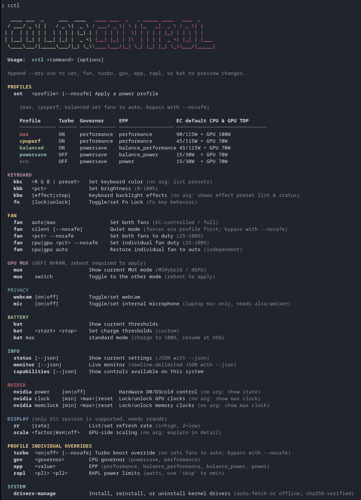
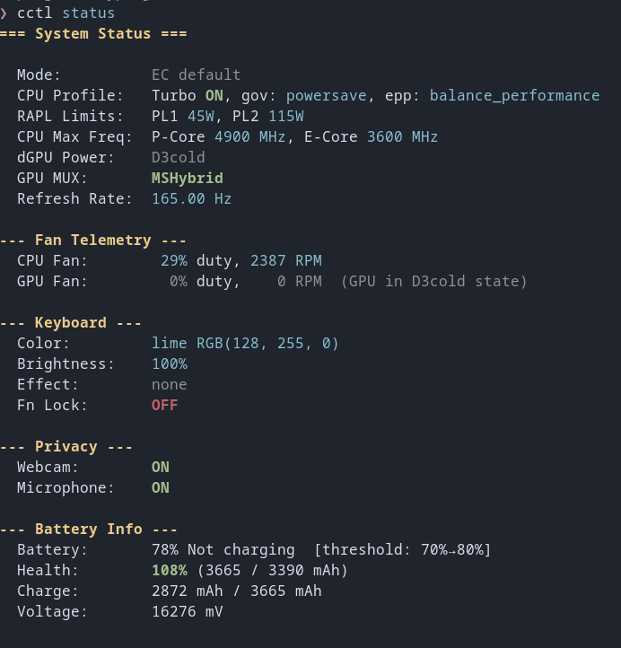
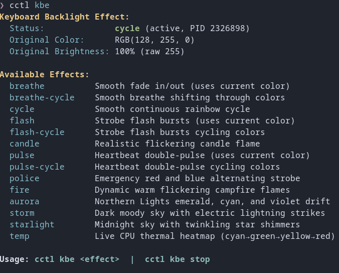
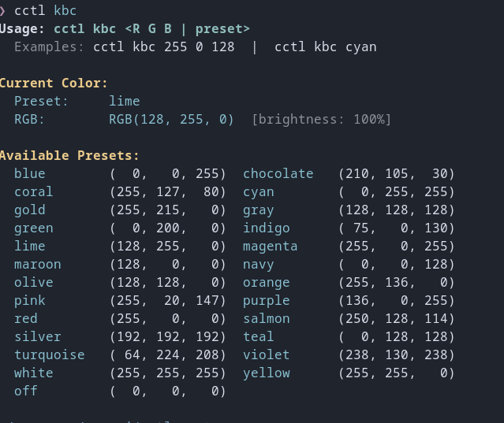

# CCTL — ColorControl

Linux CLI alternative to the Windows-only Colorful Laptop Control Center. Fast, single-binary tool for Colorful Evol P15 laptops (Clevo/TUXEDO chassis) — controls power profiles, fans, keyboard backlight, display, battery, GPU MUX switching, and NVIDIA GPU. Pure C, no GUI, no persistent daemon (keyboard effects use a lightweight background process while active).

## Hardware Compatibility

Specifically designed for the **Colorful Evol P15** series (Clevo/TUXEDO chassis).

### Tested Hardware
| Laptop | CPU | GPU | Keyboard |
|---|---|---|---|
| Colorful Evol P15 | Intel Core i7-13620H | RTX 4060 Mobile 100W | Single-zone RGB |
| Colorful Evol P15 | Intel Core i5-12500H | RTX 4050 Mobile 100W | Single-zone RGB |

### Supported Configurations
* **Series:** Colorful Evol P15 series
* **GPUs:** NVIDIA GeForce RTX 40 Series Mobile
* **CPUs:** Intel CPUs
* **Keyboard:** Single-zone RGB keyboard (tested)

> **Note:** Built specifically for Colorful Evol P15 series laptops. Other laptop models or other Clevo/TUXEDO variants may have different EC register layouts, fan byte orders, or EC profile codes — use at your own risk.

---

## Quick Start

1. Download the pre-built `cctl` binary from the **[Releases page](https://github.com/bhusann/cctl/releases)**.

```bash
# 2. Make it executable and install cctl system-wide (installs to /usr/local/bin, sets up passwordless sudo & auto-elevation)
chmod +x ./cctl && sudo ./cctl install

# 3. Install kernel drivers via DKMS (required for fans, keyboard backlight, battery)
cctl drivers-manage

# 4. Ready to use immediately (privileged commands auto-elevate seamlessly, no manual sudo or aliases needed):
cctl set balanced          # apply a power profile (auto-elevates via sudo)
cctl fan auto              # set fans to automatic (auto-elevates via sudo)
cctl status                # view all current settings
```

## Updating cctl

1. Download the latest `cctl` binary from the [official Releases page](https://github.com/bhusann/cctl/releases).
2. In the folder where you downloaded it, run:

   ```bash
   chmod +x ./cctl
   sudo ./cctl install
   ```

3. When asked to upgrade or reinstall cctl, type `y` to confirm. The installer updates the installed binary and sudo rule.

---

## Screenshots

**`cctl` — full command reference**



**`cctl status` — all current settings at a glance**



**`cctl kbe` — keyboard backlight effects**



**`cctl kbc` — keyboard color presets**



---

## Power Profiles

`set <profile> [--nosafe]` applies preset (EC defaults + table values below).
Built-in profiles are quick-use presets, not official or universal
recommendations. Choose what suits your workload, or save a preferred
combination as a [custom profile](#custom-profiles).

```
Profile     EC profile code Turbo  Governor     EPP                EC default CPU & GPU TDP
─────────── ─────────────── ────── ──────────── ────────────────── ──────────────────────────────
max         2               ON     performance  performance        90/115W + GPU 100W
cpuperf     3               ON     powersave    performance        45/115W + GPU 70W
balanced    3               ON     powersave    balance_performance 45/115W + GPU 70W
powersave   1               OFF    powersave    balance_power      15/30W  + GPU 70W
silent/eco  0               OFF    powersave    power              15/30W  + GPU 70W
```

> [!CAUTION]
> Silent mode and manual fan duty may keep fans quiet or fixed regardless of
> CPU temperature, even under heavy load. To protect the hardware, applying EC
> profile code `2` or `3`, or enabling Turbo while EC code `2` or `3` is
> active, sets fans to **AUTO** by default.
> `--nosafe` skips that automatic change and keeps the current fan setting.
> Use manual fan duty only for experimental purposes.

### EC Profiles and Governor/EPP Load Test Results

These full-load measurements on the author's 10-core, 16-thread CPU compare
the performance, power, and temperature tradeoffs. Results vary with cooling
and workload.

The `performance` EPP results were the same with either governor, so they are
combined below.

For the highest measured performance, code `2` with Turbo on and EPP
`performance` reached 85–87W, then sustained 75–76W near 98°C. Code `2` with
`powersave` / `balance_performance` sustained 63–64W around 91°C. Code `3`
offers a lower-power standard mode; codes `0` and `1` have 15W PL1 defaults.

#### EC code 3 — Standard

Defaults during this test: TAU 28 seconds, PL1 45W, PL2 115W, TCC offset 13°C
(87°C PROCHOT).

| Governor / EPP | Turbo | Peak and sustained frequency and power |
|---|---:|---:|---|
| performance or powersave / performance | On | Peak: P 4100 ± 200 MHz; E 3100–3285 MHz; 67–70W; reaches 87°C PROCHOT.<br>────────────<br>Sustained: P 3300 MHz; E 2600 MHz; 45W after the 28-second TAU. |
| performance or powersave / performance | Off | Peak & sustained: P 2400 MHz; E 1800 MHz; about 24W (frequency-limited). |
| powersave / balance_performance | On | Peak: P 3800 MHz; E 2800 MHz; 63W; reaches 87°C PROCHOT.<br>────────────<br>Sustained: P 3300 MHz; E 2600 MHz; 45W after TAU. |
| powersave / balance_performance | Off | Peak & sustained: P 2400 MHz; E 1800 MHz; about 24W (frequency-limited). |

#### EC code 2 — High performance

Defaults during this test: TAU 80 seconds, PL1 90W, PL2 115W, TCC offset 2°C
(98°C PROCHOT).

| Governor / EPP | Turbo | Peak and sustained frequency and power |
|---|---:|---:|---|
| performance or powersave / performance | On | Peak: P 4100–4300 MHz; E 3200–3300 MHz; 85–87W at 98–99°C PROCHOT.<br>────────────<br>Sustained: P 3800–3900 MHz; E 3000–3100 MHz; 75–76W at 98°C. |
| performance or powersave / performance | Off | Peak & sustained: P 2400 MHz; E 1800 MHz; about 25W. |
| powersave / balance_performance | On | Peak & sustained: P 3800 MHz; E 2800 MHz; 63–64W at about 91°C. |
| powersave / balance_performance | Off | Peak & sustained: P 2400 MHz; E 1800 MHz; about 25W. |

#### EC code 1 — Powersave, and EC code 0 — Silent

These two codes behaved the same in the test. Defaults: TAU 8 seconds, PL1
15W, PL2 30W. TCC offset is 15°C for code 1 (85°C PROCHOT) and 10°C for code
0 (90°C PROCHOT). No PROCHOT event was observed in these test cases.

| Governor / EPP | Turbo | Peak and sustained frequency and power |
|---|---:|---:|---|
| performance or powersave / performance | On | Peak: P 2700 MHz; E 2100 MHz; 30W.<br>────────────<br>Sustained: P 1500–1600 MHz; E 1200 MHz; 15W after the 8-second TAU. |
| performance or powersave / performance | Off | Peak: P 2400 MHz; E 1800 MHz; 25W.<br>────────────<br>Sustained: P 1500–1600 MHz; E 1200 MHz; 15W after TAU. |
| powersave / balance_performance | On | Peak: P 2600–2700 MHz; E 2100 MHz; 30W.<br>────────────<br>Sustained: P 1500–1600 MHz; E 1200 MHz; 15W after TAU. |
| powersave / balance_performance | Off | Peak: P 2400 MHz; E 1800 MHz; 25W.<br>────────────<br>Sustained: P 1500–1600 MHz; E 1200 MHz; 15W after TAU. |

`balance_power` and `power` behaved similarly across EC codes and are listed
once here. Codes `0` and `1` sustain lower clocks on `balance_power` after
reaching their 15W PL1 limit.

| Governor / EPP | Turbo | Peak and sustained frequency and power across EC codes |
|---|---:|---:|---|
| powersave / balance_power | On or off | Peak: P 2200 MHz; E 1600 MHz; about 22W.<br>────────────<br>Sustained: Codes `2` and `3` remain around P 2200 MHz, E 1600 MHz, 22W; codes `0` and `1` reach 15W after TAU and settle around P 1500–1600 MHz, E 1200 MHz. |
| powersave / power | On or off | Peak & sustained: P 1100 MHz; E 1100 MHz; about 12W across all codes. |


### Custom Profiles

You can add your own power profiles in `/etc/cctl/profiles.conf`. To open or
create the file, run:

```bash
cctl editconf
```

This opens the file with your configured editor (`SUDO_EDITOR`, `VISUAL`, or
`EDITOR`). If none is set, cctl tries `nano`, then `micro`. A new file includes
a commented line showing the fields.

Add one profile per line, with fields in this order:

```text
# name ec_profile_code turbo governor epp pl1_watts pl2_watts
quietwork 1 0 powersave balance_power skip skip
highcpu 2 1 performance performance 90 115
```

The first value is the profile name. The remaining values set the EC mode,
Turbo, CPU governor, EPP, and optional CPU power limits (PL1 and PL2). Write
`skip` for any value you want cctl to leave unchanged. You can also use the
original five-field format by leaving off both PL1 and PL2 values.

Profiles without custom RAPL values leave existing limits unchanged. Set
limits in `profiles.conf` or use `cctl rapl <pl1> <pl2>`.

EC profile codes select modes; they are not a ranking:

- `0` — Silent
- `1` — Powersave
- `2` — High performance
- `3` — Standard mode

Code `2` is high performance: it supports PL1 up to 90W, PL2 up to 115W, and
GPU power up to 100W. Code `3` is standard mode, with defaults of 45W/115W
CPU and 70W GPU; it is not the highest-power mode. Other codes allow PL1 up to
45W.

Use EC code `3`, `2`, `1`, or `0`; Turbo `1` (on) or `0` (off); governor
`powersave` or `performance`; and EPP `performance`, `balance_performance`,
`balance_power`, or `power`. PL1 can be up to 90W with EC code `2`, and up to
45W with other codes. PL2 can be up to 115W.

> **Caution:** If a profile line contains a typo or unsupported value, cctl
> skips it, so the profile will not appear in `cctl set` or `cctl --help`.

Custom profiles trigger automatic fan control when they apply EC code `2` or
`3`, or enable Turbo while the resulting EC code is `2` or `3`; `--nosafe`
bypasses it. Skipped or unset values show as `--` in the help table; custom
PL1/PL2 values appear in the EC TDP column, for example
`PL1 90W / PL2 115W (custom)`.

Append `--dry-run` to preview changes without applying them. Dry-run is
available for `set`, `fan`, `turbo`, `gov`, `epp`, `rapl`, and `bat`.

---

## Commands

### Keyboard Backlight
```bash
cctl kbc <color>                # Set keyboard color: R G B (0-255) or preset name
cctl kbb <pct>                  # Brightness (0-100%)
cctl kbe [effect|stop]          # Start an effect, stop & restore original color/brightness, or show status & list effects
cctl fn [lock|unlock]          # Toggle or set Fn Lock (no arg toggles, or lock/unlock)
```

Color presets: `blue` `chocolate` `coral` `cyan` `gold` `gray` `green` `indigo` `lime` `magenta` `maroon` `navy` `olive` `orange` `pink` `purple` `red` `salmon` `silver` `teal` `turquoise` `violet` `white` `yellow` `off`

Effect presets (single zone): `breathe` `breathe-cycle` `cycle` `flash` `flash-cycle` `candle` `pulse` `pulse-cycle` `police` `fire` `aurora` `storm` `temp` `ram` `sos` `firecrackers`

- `temp`: CPU temperature is cyan below 40°C. From 40°C it shifts gradually
  from light green to dark green, then through yellow and orange to red as it
  warms. At 90°C or higher, it flashes a red SOS signal.
- `ram`: RAM usage shifts gradually from cyan (up to 25%) through green,
  yellow, and orange to red (above 85%). Red pulses at 95% or higher.

*Manual Status Check*: Run `cctl kbe` to view the current active effect.

### Fan Control
```bash
cctl fan auto|max               # Both fans: EC automatic / 100% full speed
cctl fan silent [--nosafe]      # Quiet mode (forces silent/eco profile first; bypass with --nosafe)
cctl fan <pct> --nosafe         # Set both fans to duty cycle (25-100%, requires --nosafe)
cctl fan cpu|gpu <pct> --nosafe # Set individual fan duty (requires --nosafe)
cctl fan cpu|gpu auto           # Restore individual fan to automatic EC control (independent)
```

### GPU MUX Switching
Switches between **MSHybrid** (iGPU + dGPU) and **dGPU** (NVIDIA GPU only). A reboot is required to apply the change.

```bash
cctl mux                        # Show current MUX mode (MSHybrid / dGPU) & pending status
cctl mux switch                 # Toggle MUX mode (stages in UEFI NVRAM, reboot to apply)
```

> **X11 hardware quirk:** In **dGPU** mode, the internal display starts at **40 Hz on every boot**, whether dGPU mode was selected in BIOS or with `cctl mux switch`. Run `cctl rr 165` to use the full 165 Hz refresh rate. To apply it automatically, add `cctl rr 165` to your desktop environment's autostart/startup applications. *(X11 sessions only; the autostart method depends on your desktop environment.)*

### Privacy
```bash
cctl webcam [on|off]            # Toggle or set webcam
cctl mic [on|off]               # Toggle or set internal microphone (laptop mic only, needs alsa/amixer)
```

### Battery
```bash
cctl bat                        # Show charge mode and current thresholds
cctl bat <start> <stop>         # Select Custom mode, then set thresholds (e.g. 40 80)
cctl bat standard               # Select Standard charge mode
```

### Info
```bash
cctl status [--json]            # Print all current settings; --json emits a JSON object
cctl cpumon [--json]            # Live CPU, RAM, temperature, power, and fan monitor; JSON streams one sample per line
cctl gpumon [--json]            # Live NVIDIA GPU monitor; --json emits one sample per line
cctl capabilities [--json]      # Show controls detected on this system
cctl --version                  # Print version and exit (also -V)
```

### Snapshots
```bash
cctl snapshot list               # List saved snapshot numbers on one line
cctl snapshot save <number> [--mask fields]    # Save current settings
cctl snapshot view <number>    # Show a saved snapshot
cctl snapshot restore <number> [--mask fields] [--dry-run] # Apply or preview
cctl snapshot delete <number>  # Delete a saved snapshot
```

Use `--mask` to omit fields while saving or skip them while restoring. Separate
field names with commas. For example: `cctl snapshot save 2 --mask epp,pl1,turbo`.
Add `--dry-run` to `snapshot restore` to preview the settings and skipped
fields without applying changes. Restoring EC code `2`/`3` sets fans to AUTO;
restoring Turbo ON does so only when the active EC code is `2`/`3`. Add
`nosafe` to the restore mask to bypass the automatic fan change (for example,
`cctl snapshot restore 2 --mask nosafe`).
Available names are `nvidia_clock`, `nvidia_memclock`,
`ec_code`, `turbo`, `gov`, `epp`, `pl1`, `pl2`, `kbe`, `kbc`, `kbb`,
`fn_lock`, `webcam`, `mic`, `bat`, `rr`, and `scale`; `nosafe` is restore-only.
`kbc` masks keyboard
color, `kbb` brightness, `kbe` effect, and `bat` both battery thresholds.

Snapshots save system settings, CPU power settings, keyboard settings, Fn Lock,
webcam and microphone states, battery thresholds, GPU clock settings, and
display settings. Fan settings are not saved or restored.

### NVIDIA GPU
```bash
cctl gpumon [--json]                     # Live GPU telemetry and power state
cctl nvidia clock [min] <max> | reset   # Lock/unlock GPU clocks (no arg shows max clock; min defaults to 0)
cctl nvidia memclock [min] <max> | reset # Lock/unlock memory clocks (no arg shows max clock; min defaults to 0)
```

The GPU monitor reads PCI power state without waking a suspended GPU. It only
queries NVIDIA GPU telemetry while the dGPU is in D0. Press `p` to pause
NVIDIA polling while waiting for D3cold; cctl fan readings continue during the
wait and while in D3cold. Polling resumes if the GPU later returns to D0.
Press `p` again before D3cold to cancel the wait; press `q` or Ctrl-C to exit.

### Display
> **Note:** Display commands need a native **X11** session — if your desktop doesn't support one (e.g. Wayland), the `DISPLAY` section is hidden from `cctl --help` and the refresh rate from `cctl status`.
>
> Only the display panel's preconfigured refresh rates are supported — run `cctl rr` to list the valid ones for your screen and pick from that list.

```bash
cctl rr                         # List all supported refresh rates
cctl rr [1|2|<rate>]            # Set refresh rate (1=highest, 2=lowest, or explicit value like 60 or 144)
cctl scale <factor|WxH|off>    # X11 display scaling (0.75, 1920x1080, or off to reset)
```

### Profile Individual Overrides
```bash
cctl turbo on|off [--nosafe]    # Turbo ON sets fans to auto only in EC code 2/3
cctl gov powersave|performance  # CPU scaling governor
cctl epp <preference>           # performance, balance_performance, balance_power, power
cctl rapl <pl1> <pl2>           # Set PL1/PL2 in watts (use 'skip' to omit one)
```
>
> **RAPL limits:** PL2 ≤ 115 W always. PL1 ≤ 45 W normally, up to **90 W while EC profile code 2 is active**.

---

## Build

```bash
make                # Standard build (profiles, fans, display, battery, nvidia clock/power)
make install        # Build and install through cctl's installer
```

The Makefile respects `CC`, `CFLAGS`, and `LDFLAGS`. Hardening flags are always applied. Pass `STRIP=0` to keep debug symbols.

---

## Kernel Drivers

The Clevo/TUXEDO driver stack (`clevo_acpi`, `tuxedo_keyboard`, `tuxedo_io`) is required for fan control, keyboard backlight, battery thresholds, and EC profile codes. The installer handles DKMS registration, build, and modprobe config.

**Driver sources live only in the mirror repo:** https://github.com/bhusann/tuxedo-drivers-cctl-mirror — a readable `drivers/` folder plus the pre-packed `drivers.tar.gz`. Every GitHub **release** of cctl also attaches that *identical* tarball.

Install or uninstall directly with the script (it lives in the mirror repo):

```bash
git clone https://github.com/bhusann/tuxedo-drivers-cctl-mirror
sudo tuxedo-drivers-cctl-mirror/drivers/driverinstall.sh --install
sudo tuxedo-drivers-cctl-mirror/drivers/driverinstall.sh --uninstall
tuxedo-drivers-cctl-mirror/drivers/driverinstall.sh --status   # no root needed
```

### Supported Distros

Auto-installs `dkms` + kernel headers if missing, with confirmation prompt:

| Package Manager | Distros | Tested |
|---|---|---|
| `pacman` | Arch, Manjaro, EndeavourOS, CachyOS, Garuda | ✅ Arch, CachyOS |
| `apt` | Debian, Ubuntu, Mint, Pop!_OS, Zorin | — |
| `dnf` | Fedora (standard Workstation/Spins), RHEL, Rocky, Alma | — |
| `zypper` | openSUSE Tumbleweed/Leap | — |
| `xbps` | Void Linux | — |
| `emerge` | Gentoo | — |
| `eopkg` | Solus | — |

> **Immutable / Atomic OS note:** Atomic and immutable editions of Fedora (Silverblue, Kinoite, Atomic Desktops, Bazzite, etc. using `rpm-ostree`) are **not supported** because the root filesystem is read-only and DKMS modules cannot persist across image updates. Only standard, non-atomic Fedora (Workstation, KDE Spin, etc. using regular `dnf`) is supported. On unrecognized distros, the installer points to the driver source in the mirror repo for manual installation.

---

## Uninstallation

Drivers first, then the cctl binary — in that order, so cctl is still around for the clean driver removal.

### Automated Uninstallation (Recommended)

1. **Kernel drivers** — `sudo cctl drivers-manage` and select the uninstall option (it cleanly unloads the modules and deregisters DKMS):

```bash
sudo cctl drivers-manage   # select the uninstall option
```

2. **cctl and its data** — run the uninstall command:

```bash
sudo cctl uninstall
```

Type `yes` in full to confirm. This removes the cctl binary, sudoers rule and
backup, custom profiles, and saved cctl data under `/var/lib/cctl`. If cctl
detects loaded TUXEDO/Clevo modules, it recommends removing them first with
`cctl drivers-manage`; you can confirm to remove cctl while leaving the drivers
installed. It is recommended to uninstall the drivers first, before uninstalling
the cctl binary.

### Manual Uninstallation

Same order — unload and remove the drivers first, then the cctl binary itself.

Run the mirror's script directly (works without cctl):

```bash
git clone https://github.com/bhusann/tuxedo-drivers-cctl-mirror
sudo tuxedo-drivers-cctl-mirror/drivers/driverinstall.sh --uninstall
```

Or do it step by step:

1. **Unload active kernel modules** (in reverse dependency order):
   ```bash
   sudo modprobe -r clevo_acpi
   sudo modprobe -r tuxedo_io
   sudo modprobe -r tuxedo_keyboard
   ```

2. **Unregister and remove DKMS module**:
   ```bash
   sudo dkms remove tuxedo-drivers/1.0 --all
   sudo rm -rf /var/lib/dkms/tuxedo-drivers
   ```

3. **Remove driver source files and modprobe options**:
   ```bash
   sudo rm -rf /usr/src/tuxedo-drivers-1.0
   sudo rm -f /etc/modprobe.d/tuxedo_keyboard.conf
   ```

4. **Update module dependency cache**:
   ```bash
   sudo depmod -a
   ```

5. **cctl binary & sudoers**:
   ```bash
   # Remove installed binary
   sudo rm -f /usr/local/bin/cctl

   # Remove passwordless sudo rule (+ backup)
   sudo rm -f /etc/sudoers.d/cctl /etc/sudoers.d/cctl.bak

   # Optional: remove the persistent driver cache
   sudo rm -rf /var/lib/cctl
   ```

---

## Developer Notes

See [docs/developer-notes.md](docs/developer-notes.md).

---

## License

`cctl` own code is licensed under the MIT License — see [LICENSE](LICENSE).

The driver code (in the [mirror repo](https://github.com/bhusann/tuxedo-drivers-cctl-mirror)'s `drivers/` folder) is **not** MIT. It is derived from the TUXEDO Linux driver project and remains under **GPL-2.0-or-later** — see [drivers/LICENSE](https://github.com/bhusann/tuxedo-drivers-cctl-mirror/blob/main/drivers/LICENSE) and [THIRD-PARTY-NOTICES](THIRD-PARTY-NOTICES).

## Credits

`cctl` uses driver code from the TUXEDO Linux driver project:

https://github.com/tuxedocomputers/tuxedo-drivers

The driver code is licensed under GPL-2.0-or-later. Copyright belongs to the respective original authors (TUXEDO Computers GmbH and contributors).

GPU MUX reverse-engineered findings are referred from this repo:

https://github.com/arbitrary-string/clevo-control-panel
